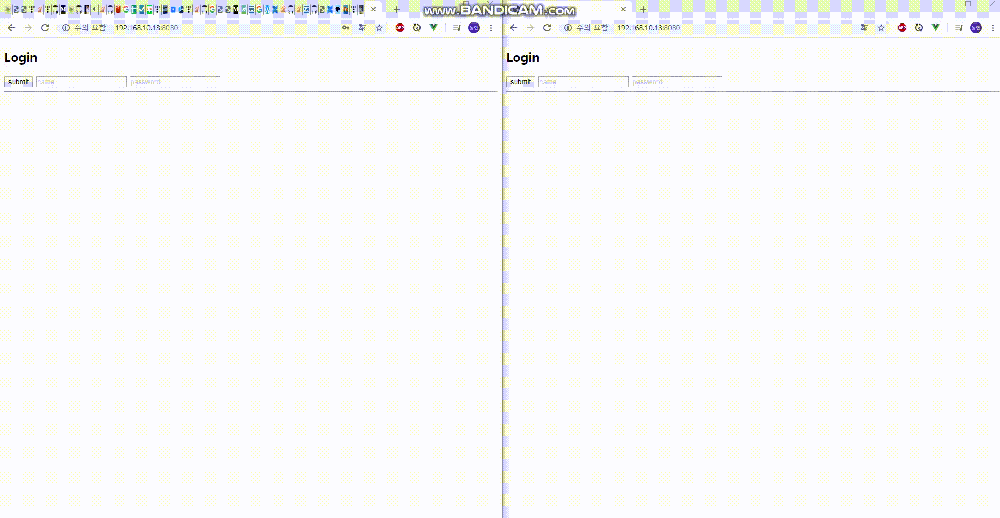

# 구글 스프레드 시트 프로젝트

## 📖 기술스택 

- JDK 11
- SpringBoot
- H2 DB
- Gradle
- Lombok
- WebSocket
- STOMP
- Redis
- Spring-Security

## 👍 TODO

- ~~인증권한 구현~~
- ~~Redis를 이용한 데이터 영속화~~
- ~~Scabable~~
- Redis High Availability
- Client-Side Load-Balancing

## ✌ Front-End 

https://github.com/wemb-toy-project-01/spread-sheet-01

## 👀Demo

